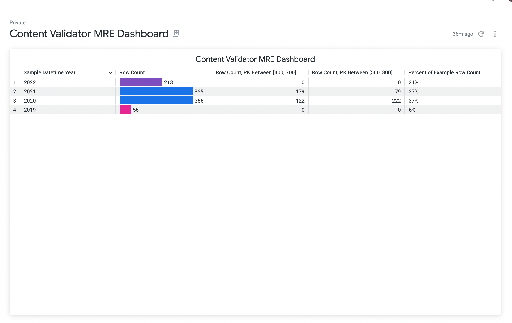
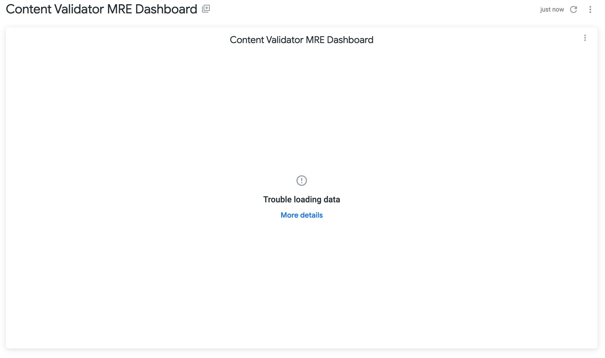
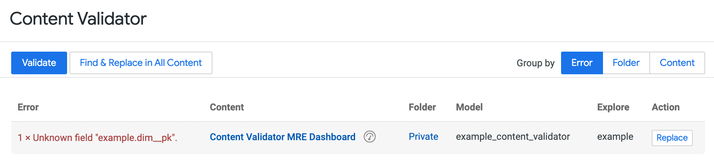
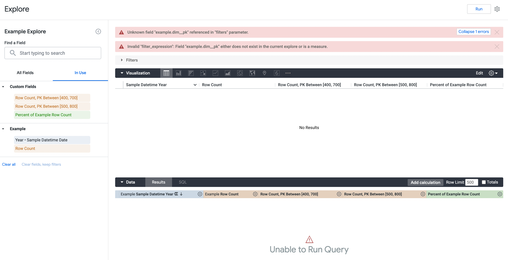
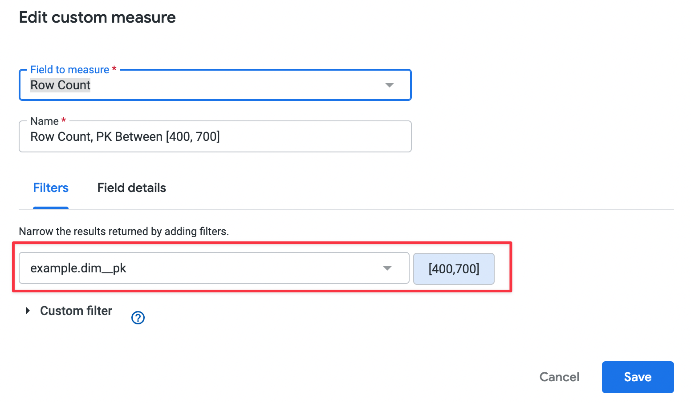
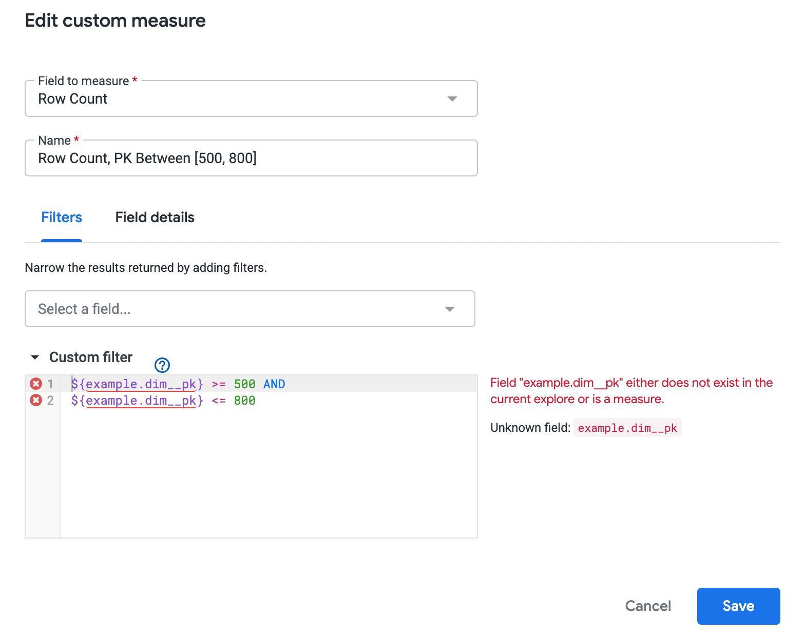

# Minimally reproducible example demonstrating Looker's Content Validator bug

## The Bug

Looker's  Content Validtor does detect or replace fields in Custom field button style "Filter", all three custom field types are affected.

- Custom Measure
- Custom Dimension
- Table Calculation

_**Looker version at the time of reproduction on Aug 2nd, 2022: 22.12.38**_

Below are the steps to reproduce the problem with the provided minimally reproducible example project in this repository.

## Reproducing the problem

### Prepare the project

1. Create new project in Looker with "Starting Point" set to `git@github.com:jpuris/looker-content-validator-mre.git`
2. Open file `/example_content_validator.model.lkml` and change the `connection` model parameter value to a valid Redshift or PostgreSQL connection
3. If PostgreSQL connection had ben chosen, then comment line 10 and uncomment line 13
4. Publish
6. Verify the new "Content Validator MRE Dashboard" dashboard works
7. Convert the LookML dashboard to User-Defined dashboard; `Actions > Copy LookML dashboard`
8. Open the User-Defined dashboard created in previous step



### Create a problem

1. Open URI file `/example_content_validator.model.lkml`
2. Change line 19

from

```
 dimension: dim__pk {
```

to

```
dimension: dim__pk_new {
```

3. Verify the dashboard's only tile is now broken and shows "Trouble loading data"



### Running the Content Validator

1. Open `Content Validator` and run it with `Validate`
2. It will report that there is `1 x Unknown field` as expected
3. Fix the problem by pressing `Replace`

```
Field name: example.dim__pk
Replacement Field Name: example.dim__pk_new
```



3. Run `Validate` again to see that there are no problem discovered
4. Go back to the User-Defined dashboard to discover the problem is not fixed
5. Open the tile's query in an explore interface with `Tile Action > Explore from here`



### Problem reproduced...

After following the steps to reproduce the problem, we now see a two messages. One for each of our custom measures with differently set filters

- `Filter`

```
Unknown field "example.dim__pk" referenced in "filters" parameter.
```



- `Custom filter`

```
Invalid "filter_expression": Field "example.dim__pk" either does not exist in the current explore or is a measure.
```




This message is there because the custom measure with name `Row Count, PK Between [400, 700]` has a broken filter referencing the old `example.dim__pk` dimension. The **Content Validator** does not detect this issue nor does it fix it when the dimension was replaced "fixed" by it earlier!

After manually fixing the custom measure `Row Count, PK Between [400, 700]` and `Row Count, PK Between [500, 800]` the query works again as expected!


### This repository will be taken down as soon as Looker has corrected this massive flaw
